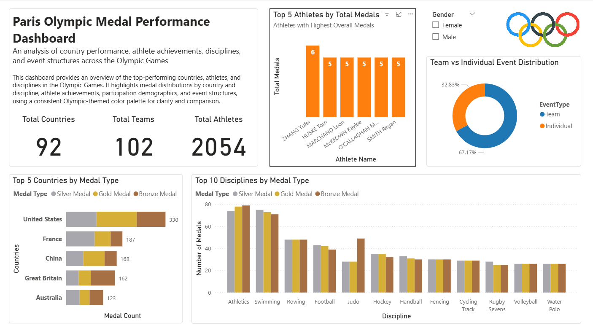
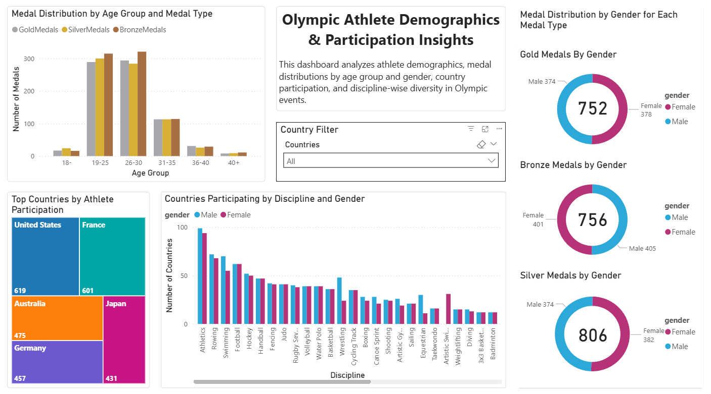
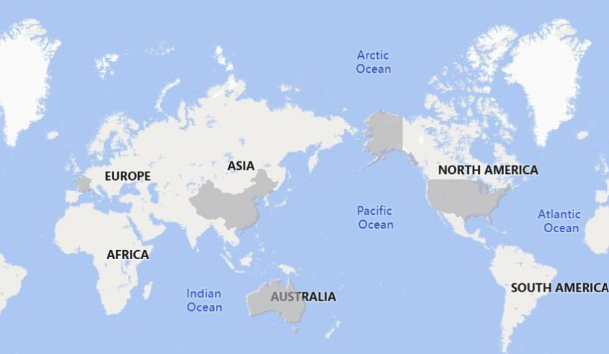

# Paris Olympics 2024 – Data Visualizations & Insights

This project analyzes **Paris 2024 Olympic Games data** using **Power BI** and **Visme**, with the goal of uncovering insights on athlete demographics, medal performance, and country participation.  
Deliverables include **interactive dashboards** and a **final infographic**, demonstrating best practices in **data visualization and storytelling**.

---

## 📊 Project Overview
- **Objective:** Explore Olympic data to identify trends in medal distribution, athlete demographics, and country performance.  
- **Techniques Used:**  
  - Data preparation & cleaning (Excel, Power BI)  
  - Interactive dashboards (medals, athletes, participation)  
  - Infographic storytelling (Visme)  
  - Storyboarding & design planning  

---

## 📈 Key Insights
- **Top Countries & Athletes**: Dominance patterns are clear in medal counts and athlete participation.  
- **Demographics**: Most medals are won by athletes aged **19–30**; gender distribution is nearly balanced.  
- **Events**: Team vs. Individual events show significant variation in medal contributions.  
- **Country Performance**: The **United States, France, and China** emerge as top-performing nations.  

---

## 📑 Reports & Deliverables
- [Final Infographic (PDF)](reports/paris_olympics_analysis_infographic.pdf)  
- [Power BI Dashboard (PBIX)](dashboard/paris_olympics_dashboard.pbix)  

---

## 📊 Sample Visualizations

### Dashboard – Medal Performance Overview

### Dashboard – Athlete Demographics & Participation

### World Participation Map

---

## 🛠️ Tools & Libraries
- **Power BI** – Interactive dashboards  
- **Visme** – Infographic design  
- **Microsoft Excel** – Dataset preparation  

---

## 📚 Key Learnings
- Developed skills in building **interactive dashboards** with Power BI.  
- Learned how to design **storyboards** for structured storytelling.  
- Created an **infographic** to summarize findings in a compelling way.  
- Improved ability to communicate insights using **age, gender, and country-based breakdowns**.  

---

## 📜 License
This project is released under the **MIT License**.
